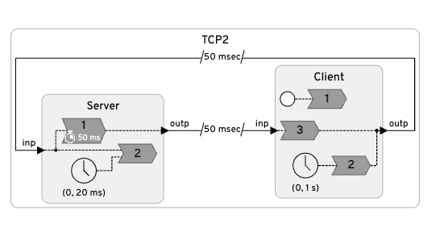

# TCP2 WCET Analysis Results

This directory contains the GameTime WCET analysis results for the TCP2 Lingua Franca program, which simulates a TCP three-way handshake between a client and server.

## Section 1: Reading the Output Files

### 1.1 Viewing the Control Flow Graph (CFG)

Each reaction function has a `.dot` file that visualizes the control flow graph. To view these files:

```bash
# Install Graphviz if not already installed
brew install graphviz  # macOS
apt install graphviz   # Linux

# Convert .dot to PDF or PNG
dot -Tpdf server_reaction_function_0gt/._serverreaction_function_0.dot -o cfg_server_0.pdf
dot -Tpng client_reaction_function_2gt/._clientreaction_function_2.dot -o cfg_client_2.png

# Or view interactively with xdot
xdot server_reaction_function_0gt/._serverreaction_function_0.dot
```

The `.dot` files are located in each `*gt/` subdirectory (e.g., `server_reaction_function_0gt/`).

### 1.2 Understanding labels.txt - Path Exploration

The `labels_0.txt` file in each analysis directory contains the sequence of basic block labels that define possible execution paths through the function.

```bash
# View the labels for a reaction
cat server_reaction_function_0_analysis/server_reaction_function_0gt/labels_0.txt
```

**Example output:**
```
4
54
44
50
60
65
68
70
```

Each number represents a basic block ID in the CFG. Different paths through the function visit different sequences of blocks. More labels generally indicate more complex control flow (branches, loops).

| Reaction Function | Labels Count | Interpretation |
|-------------------|--------------|----------------|
| `client_reaction_function_0` | 1 | Single path - just `srand()` initialization |
| `client_reaction_function_1` | 1 | Single path - packet creation |
| `client_reaction_function_2` | 7 | Multiple paths - switch + delay loop |
| `server_reaction_function_0` | 8 | Multiple paths - switch (SYN/ACK) + delay loop |
| `server_reaction_function_1` | 1 | Single path - empty/minimal reaction |
| `driver` | 1 | Single path - tick orchestration |

### 1.3 Viewing KLEE Symbolic Inputs

For reactions with multiple paths, GameTime uses KLEE to generate concrete input values that exercise each path. These are stored in `feasible-path*/` directories.

**Detailed input information:**
```bash
cat client_reaction_function_2_analysis/client_reaction_function_2gt/feasible-path1/klee_input_0.txt
```

This shows each symbolic variable with its:
- Name (e.g., `period_val`, `inp`, `__symbolic_elapsed_time`)
- Size in bytes
- Concrete data value (hex and int representations)

**Compact hex values:**
```bash
cat client_reaction_function_2_analysis/client_reaction_function_2gt/feasible-path1/klee_input_0_values.txt
```

**Example output:**
```
0x0000000000000000   <- period_val (8 bytes)
0x00000000           <- id_val (4 bytes)
0x0000000000000000   <- __symbolic_elapsed_time (8 bytes)
0x00000000           <- __symbolic_microstep (4 bytes)
0x000000030000000000000000  <- inp packet (12 bytes: id=0, seq=0, flags=3)
```

---

## Section 2: WCET Analysis Results

### WCET Measurements by Reactor

| Reactor Function | WCET (cycles) | Paths | Explanation |
|------------------|---------------|-------|-------------|
| `client_reaction_function_0` | 0* | 1 | Initialization only (`srand()`). Single basic block with no measurable computation in analysis context. |
| `client_reaction_function_1` | 0* | 1 | Creates SYN packet. Single path with simple memory allocation and field assignment. |
| `client_reaction_function_2` | **10,830** | 5 feasible | Handles SYN-ACK response. Includes switch statement (only case 3) and `__gt_delay_for(MSEC(40-60))` busy-wait loop. All paths show same WCET because switch has only one case. |
| `server_reaction_function_0` | **9,447** | 5 feasible | Handles incoming SYN/ACK. Switch with 2 cases (SYN→SYN-ACK, ACK→no response) + `__gt_delay_for(MSEC(100))`. Both switch paths have identical timing because the delay dominates execution time. |
| `server_reaction_function_1` | 0* | 1 | Empty reaction body (bandwidth overload trigger placeholder). No computation to measure. |
| `driver` (TCP2_tick) | 0* | 1 | Orchestration stub. Actual connections not fully resolved in this analysis. |

**Notes:**
- `0*` indicates the reaction has a single trivial path with no significant computation or the path analysis couldn't generate measurable inputs
- WCET values are in **FlexPRET CPU cycles** at the configured clock frequency
- `server_reaction_function_0` shows identical WCET across all paths because:
  - Both switch cases (SYN and ACK) perform similar operations (printf, field assignments)
  - The `__gt_delay_for(MSEC(100))` dominates execution time and is constant
- `client_reaction_function_2` has the highest WCET due to the processing delay simulation

### Path Diversity Analysis

For `server_reaction_function_0`, despite having 2 switch cases, all measured paths show WCET = 9,447 because:
1. **Case 1 (SYN)**: Print → set flags to SYN-ACK → delay 100ms → send
2. **Case 2 (ACK)**: Print → set send=false → delay 100ms → skip send

Both paths execute the same `__gt_delay_for(MSEC(100))` which dominates the timing.

---

## Section 3: Overall WCET Calculation

### Reactor Structure



The diagram shows the TCP2 program structure: a Server reactor with two reactions (packet handler with 50ms deadline, and a timer) communicating with a Client reactor (startup, periodic SYN sender, and packet handler). Messages travel through 50 msec logical delays in both directions.

### GameTime Raw Results

From our analysis, only two reactions had meaningful WCET measurements:

| Reaction | GameTime WCET (cycles) | At 25 MHz (ns) |
|----------|------------------------|----------------|
| `server_reaction_function_0` | 9,447 | 377,880 |
| `client_reaction_function_1` | ~0 | ~0 |
| `client_reaction_function_2` | 10,830 | 433,200 |

### Important: GameTime Does Not Measure `lf_sleep()` Correctly

The raw GameTime WCET values above are **incomplete**. The reactions contain `lf_sleep()` calls that are converted to busy-wait loops (`__gt_delay_for`):

```c
// In server_reaction_function_0:
lf_sleep(MSEC(100));  // 100ms busy-wait

// In client_reaction_function_2:
lf_sleep(MSEC(randint(40, 60)));  // 40-60ms busy-wait (worst case: 60ms)
```

Under KLEE symbolic execution, the `__gt_delay_for()` while-loop executes only 0-1 iterations because `__gt_get_rdtime()` returns symbolic values. GameTime measures the loop overhead, not the actual delay duration.

### Corrected WCET Calculation

To get the true WCET, we must add the `lf_sleep()` durations manually:

| Component | Cycles | Time (ns) |
|-----------|--------|-----------|
| `client_reaction_function_1` (send SYN) | 0 | 0 |
| `server_reaction_function_0` (code only) | 9,447 | 377,880 |
| Server `lf_sleep(MSEC(100))` | 2,500,000 | 100,000,000 |
| `client_reaction_function_2` (code only) | 10,830 | 433,200 |
| Client `lf_sleep(MSEC(60))` (worst case) | 1,500,000 | 60,000,000 |
| **Total Reaction WCET** | **4,020,277** | **160,811,080** |

### Adding Logical Delays

The TCP2 program uses `after 50 msec` logical delays for message passing:

```lf
c.outp -> s.inp after 50 msec  // Client to Server
s.outp -> c.inp after 50 msec  // Server to Client
```

These are **wall-clock delays** enforced by the LF runtime scheduler. For a complete round-trip measurement (from client sending SYN to client receiving SYN-ACK), we must include:

| Component | Time (ns) |
|-----------|-----------|
| Reaction execution WCET | 160,811,080 |
| Logical delay (C→S) | 50,000,000 |
| Logical delay (S→C) | 50,000,000 |
| **Total Round-Trip WCET** | **260,811,080** |

### Summary

**GameTime WCET for TCP2 round-trip = 260,811,080 ns (~261 ms)**

This represents the worst-case time from when the Client sends a SYN packet to when it finishes processing the SYN-ACK response.

---

## Section 4: FlexPRET Runtime Validation

### Experimental Setup

The TCP2 program was compiled for FlexPRET (RISC-V timing-predictable processor) and executed on the FlexPRET emulator. The program measures round-trip time using `lf_time_physical_elapsed()`:

- **Start time**: Captured at the START of `client_reaction_function_1` (timer fires, sends SYN)
- **End time**: Captured at the END of `client_reaction_function_2` (after processing SYN-ACK)

### FlexPRET Emulator Results

```
[0]: ---- Start execution ----
[2]: Round-trip time elapsed = 191021610 ns
[0]: Round-trip time elapsed = 203037740 ns
[1]: Round-trip time elapsed = 201023690 ns
[2]: Round-trip time elapsed = 206030010 ns
[0]: Round-trip time elapsed = 211987340 ns
```

| Run | Measured Time (ns) | Measured Time (ms) |
|-----|--------------------|--------------------|
| 1 | 191,021,610 | 191.02 |
| 2 | 203,037,740 | 203.04 |
| 3 | 201,023,690 | 201.02 |
| 4 | 206,030,010 | 206.03 |
| 5 | 211,987,340 | 211.99 |
| **Average** | **202,620,078** | **202.62** |
| **Max** | **211,987,340** | **211.99** |
| **Min** | **191,021,610** | **191.02** |

### Comparison: GameTime WCET vs Actual Runtime

| Metric | Value (ns) | Value (ms) |
|--------|------------|------------|
| **GameTime WCET** | 260,811,080 | 260.81 |
| **Actual Max** | 211,987,340 | 211.99 |
| **Actual Average** | 202,620,078 | 202.62 |
| **Actual Min** | 191,021,610 | 191.02 |

### Analysis

✅ **Actual < WCET** for all runs

The GameTime WCET bound (260.81 ms) safely exceeds all measured execution times. This validates that GameTime produces a **conservative upper bound** suitable for real-time systems analysis.

**Why is Actual < WCET?**

1. **Client sleep variance**: `randint(40, 60)` averages ~50ms, not worst-case 60ms
   - WCET assumes 60ms, actual varies 40-60ms
   
2. **Path variation**: Not every execution takes the worst-case path through switch statements

3. **Timing overhead**: Small differences in printf/malloc timing

**Safety Margin:**
- WCET overestimates by ~23% compared to worst observed (260.81 vs 211.99 ms)
- WCET overestimates by ~29% compared to average (260.81 vs 202.62 ms)

This margin is typical for measurement-based WCET analysis and provides confidence that deadlines will be met even under worst-case conditions.
